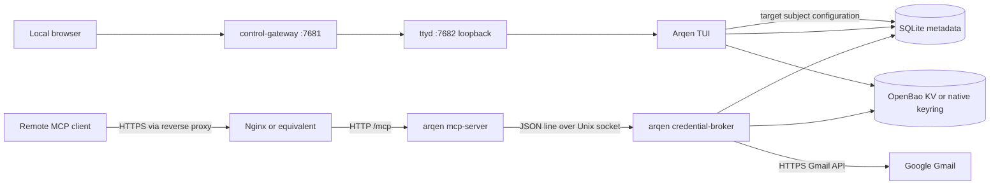

# Architecture overview

**Status:** `verified-repository` for the components and paths below.

Arqen has one Rust package and one binary with four runtime entry points:
the default TUI, `control-gateway`, `credential-broker`, and `mcp-server`.
The Docker-native local profile runs the gateway/TUI, broker, and MCP roles in
one Compose project, with OpenBao as the refresh-token store and ttyd kept
behind the gateway. Native user services remain the host-side alternative.
The MCP server never reads a credential
store directly. It asks the broker to resolve the one explicitly selected
Google subject and to call Gmail with a short-lived access token.

Responsibilities are intentionally narrow:

| Boundary | Owns | Does not own |
| --- | --- | --- |
| Control gateway (`src/control/`) | Local password page, memory-only browser sessions, ttyd HTTP/WebSocket proxy | OAuth, account choice, password persistence, public exposure |
| TUI (`src/tui/`, `src/ui/`) | Account login/logout, loopback or container-published OAuth callback, target selection, presentation | MCP HTTP, service lifecycle, access-token caching |
| Store (`src/store/`, `src/lib.rs`) | Account metadata, exact granted scopes, singleton target subject | Refresh/access token values |
| OAuth (`src/auth/`) | PKCE, callback exchange, refresh, protected-store coordinates | Gmail message presentation |
| Broker (`src/broker/`) | Target validation, refresh-token read, access-token cache, Gmail call | Public network listener, MCP sessions |
| Gmail client (`src/gmail/`) | Bounded list/get metadata requests and summaries | Token persistence |
| MCP server (`src/server/`, `src/mcp.rs`) | Streamable HTTP, bearer gate, tool schema, wire errors | Credential-store access and account choice |
| systemd user units (`deploy/systemd/`) | Host broker restart and optional all-native MCP lifecycle | OAuth consent, secret creation, public deployment |
| Docker-native Compose (`deploy/containers/docker-native-compose.yml`) | OpenBao, control TUI, broker, and loopback MCP lifecycle; native display access is limited to the control override | Public exposure, live OAuth consent, account migration |

The base Compose file defines the four services once. `make docker-up` selects
exactly one small display override for `arqen-control`: Wayland mounts the
session socket; X11 mounts the X socket and Xauthority file. These files are
merged with the base file and do not create extra containers or independent
stacks.

The MCP exposes `list_labels`, `list_emails`, and `read_email` plus separate
per-message `mark_email_read` and `mark_email_unread` tools for the configured
target. Agents can call `list_labels`, choose a label by
name, and pass its ID explicitly to `list_emails.label_ids`; list results
continue to return Gmail IDs. `list_emails` returns bounded metadata/snippets
only, and an agent can pass one result's `id` to `read_email` to retrieve
decoded body text. Read-state changes require the selected account's recorded
`gmail.modify` grant; target selection and read-only tools still require only
`gmail.readonly`. The tools accept no account-selection parameter, and
attachments are not downloaded.
