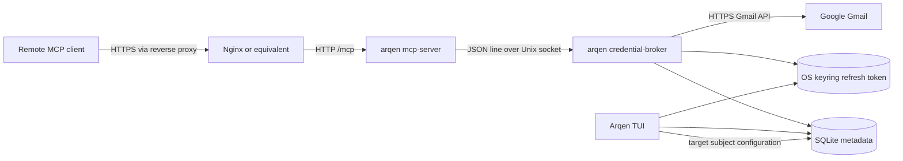

# Architecture overview

**Status:** `verified-repository` for the components and paths below.

Arqen has one Rust package and one binary with three runtime entry points:
the default TUI, `credential-broker`, and `mcp-server`. In the unattended
deployment, the broker and MCP entry points run as separate systemd user
services; the TUI is an optional configuration frontend. The MCP server never
reads the OS keyring directly. It asks the host broker to resolve the one
explicitly selected Google subject and to call Gmail with a short-lived access
token.

Responsibilities are intentionally narrow:

| Boundary | Owns | Does not own |
| --- | --- | --- |
| TUI (`src/main.rs`, `src/ui/`) | Account login/logout, SSH-forwarded OAuth callback, target selection, presentation | MCP HTTP, service lifecycle, access-token caching |
| Store (`src/lib.rs`) | Account metadata, exact granted scopes, singleton target subject | Refresh/access token values |
| OAuth (`src/auth.rs`) | PKCE, callback exchange, refresh, keyring coordinates | Gmail message presentation |
| Broker (`src/broker.rs`) | Target validation, refresh-token read, access-token cache, Gmail call | Public network listener, MCP sessions |
| Gmail client (`src/gmail.rs`) | Bounded list/get metadata requests and summaries | Token persistence |
| MCP server (`src/server.rs`, `src/mcp.rs`) | Streamable HTTP, bearer gate, tool schema, wire errors | Keyring access and account choice |
| systemd user units (`deploy/systemd/`) | Host broker restart and optional all-native MCP lifecycle | OAuth consent, secret creation, public deployment |
| Docker Compose (`deploy/containers/`) | First-pass always-on MCP HTTP boundary | SQLite, OS keyring, OAuth, account choice |

The first tool is read-only `list_emails`. It returns bounded message
metadata/snippets for the configured target; it does not expose full message
bodies or a second account-selection parameter.
