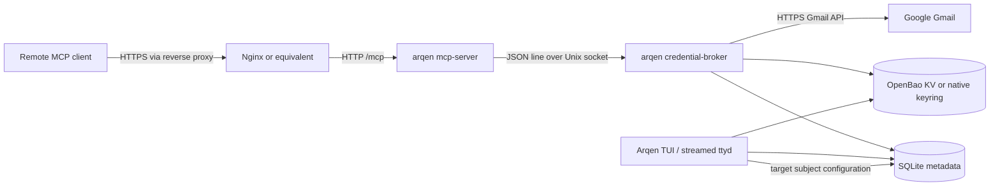

# Architecture overview

**Status:** `verified-repository` for the components and paths below.

Arqen has one Rust package and one binary with three runtime entry points:
the default TUI, `credential-broker`, and `mcp-server`. The Docker-native local
profile runs all three roles as separate containers, with OpenBao as the
refresh-token store and the TUI streamed through `ttyd`. Native user services
and the host-broker/VPS Compose path remain compatibility alternatives. The
MCP server never reads a credential store directly. It asks the broker to
resolve the one explicitly selected Google subject and to call Gmail with a
short-lived access token.

Responsibilities are intentionally narrow:

| Boundary | Owns | Does not own |
| --- | --- | --- |
| TUI (`src/main.rs`, `src/ui/`) | Account login/logout, loopback or container-published OAuth callback, target selection, presentation | MCP HTTP, service lifecycle, access-token caching |
| Store (`src/lib.rs`) | Account metadata, exact granted scopes, singleton target subject | Refresh/access token values |
| OAuth (`src/auth.rs`) | PKCE, callback exchange, refresh, protected-store coordinates | Gmail message presentation |
| Broker (`src/broker.rs`) | Target validation, refresh-token read, access-token cache, Gmail call | Public network listener, MCP sessions |
| Gmail client (`src/gmail.rs`) | Bounded list/get metadata requests and summaries | Token persistence |
| MCP server (`src/server.rs`, `src/mcp.rs`) | Streamable HTTP, bearer gate, tool schema, wire errors | Credential-store access and account choice |
| systemd user units (`deploy/systemd/`) | Host broker restart and optional all-native MCP lifecycle | OAuth consent, secret creation, public deployment |
| Docker-native Compose (`deploy/containers/docker-native-compose.yml`) | OpenBao, control TUI, broker, and loopback MCP lifecycle; native display access is limited to the control override | Public exposure, live OAuth consent, account migration |
| Legacy Docker Compose (`deploy/containers/docker-compose.yml`) | First-pass always-on MCP HTTP boundary | SQLite, native keyring, OAuth, account choice |

The first tool is read-only `list_emails`. It returns bounded message
metadata/snippets for the configured target; it does not expose full message
bodies or a second account-selection parameter.
