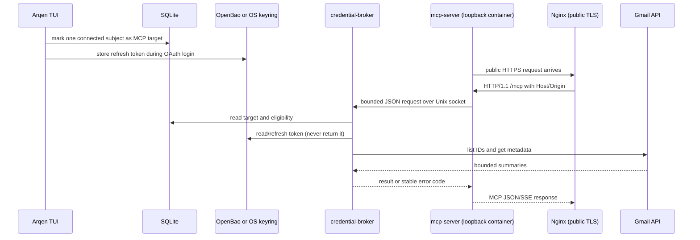

# Runtime topology and lifecycle

**Status:** `verified-repository` for source and checked-in templates;
`assumption` for host/container wiring until an operator deploys it.

The intended deployment separates the process that can read credentials from
the process that is reachable over the network. The Docker-native local profile
places the TUI, broker, SQLite, OpenBao, and MCP roles in one Compose project;
the native and legacy VPS profiles retain the host-keyring variant.

The broker socket defaults to `${XDG_RUNTIME_DIR}/arqen/gmail-broker.sock` and
is created with a user-only directory/socket mode. The container example
mounts that socket read-only and binds its HTTP port to loopback; Nginx is the
public TLS boundary. The service templates do not create certificates, DNS,
firewall rules, users, or secret files.

The Docker-native path publishes only loopback ports 7681 (Arqen control
gateway), 8765 (OAuth callback), and 8787 (MCP); ttyd stays on control-container
loopback port 7682, and OpenBao is internal-only. The gateway owns the generated
control-password check and forwards an internal auth header to ttyd; it keeps
browser sessions in memory and does not persist credentials. The MCP container
receives only its bearer-token file and broker socket. `make docker-up` mounts a
detected Wayland or X11 clipboard interface only into the control container.
The locked first-pass VPS path keeps the TUI, SQLite, OS keyring, and credential
broker on the host, and runs only `mcp-server` in Docker Compose.
In both paths,
`/healthz` reports HTTP liveness and `/readyz` reports broker/database/target
readiness without calling Gmail. The native `arqen-mcp.service` remains an
alternative for non-Docker hosts.

For a headless VPS login, the TUI can bind a configured loopback callback port
(`ARQEN_OAUTH_REMOTE=1`, default `8765`). The operator forwards that port with
SSH and opens the authorization URL in a local browser. No public OAuth
callback route is required.

Credential failures are fail-closed. A stale or disconnected target is not
replaced automatically; a missing target returns `target_not_configured`, and
an expired/revoked Google grant returns `reauthentication_required` without
changing SQLite connection state.

MCP transport sessions are process-local memory in the HTTP server. They are
not durable account configuration and are not written to SQLite; a server
restart requires a client handshake again.
