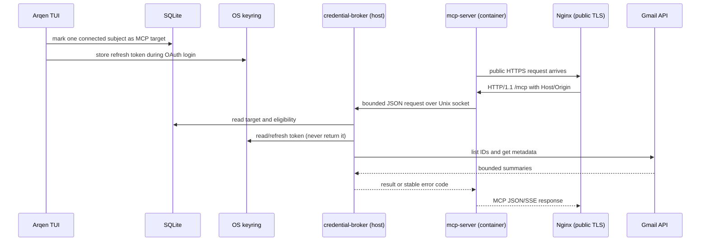

# Runtime topology and lifecycle

**Status:** `verified-repository` for source and checked-in templates;
`assumption` for host/container wiring until an operator deploys it.

The intended deployment separates the process that can read credentials from
the process that is reachable over the network:

The broker socket defaults to `${XDG_RUNTIME_DIR}/arqen/gmail-broker.sock` and
is created with a user-only directory/socket mode. The container example
mounts that socket read-only and binds its HTTP port to loopback; Nginx is the
public TLS boundary. The service templates do not create certificates, DNS,
firewall rules, users, or secret files.

Credential failures are fail-closed. A stale or disconnected target is not
replaced automatically; a missing target returns `target_not_configured`, and
an expired/revoked Google grant returns `reauthentication_required` without
changing SQLite connection state.

MCP transport sessions are process-local memory in the HTTP server. They are
not durable account configuration and are not written to SQLite; a server
restart requires a client handshake again.
