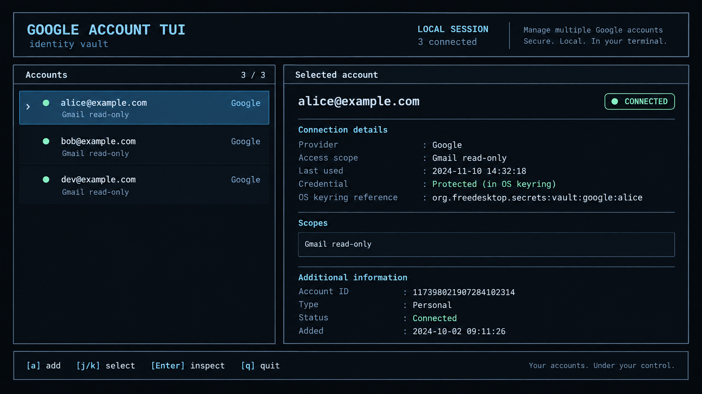
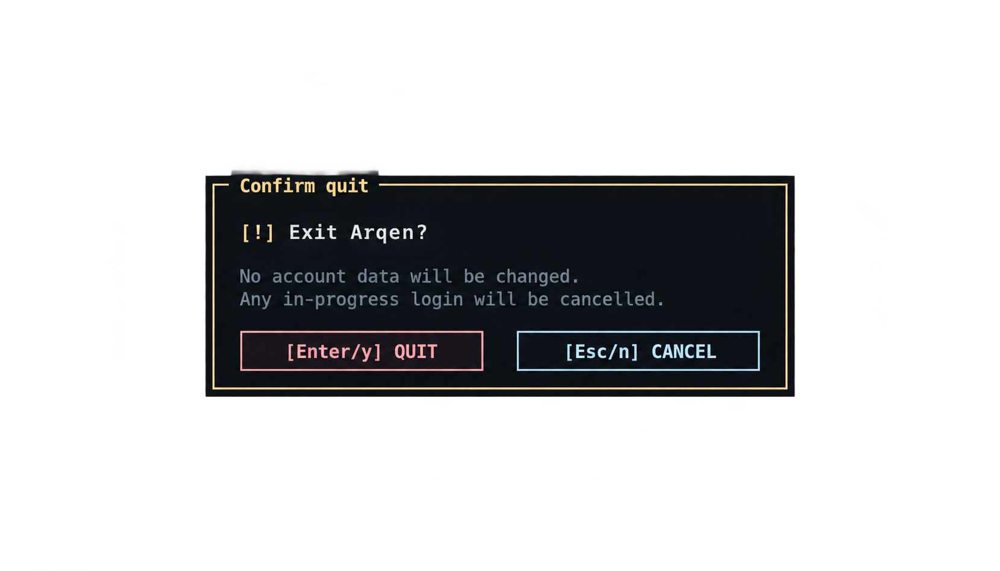

# Arqen TUI mockup

This image is the visual reference for the Arqen Ratatui account screen. It is a
design reference only; it does not contain live account data and does not prove
OAuth, keyring, deployment, or runtime behavior.

The original image includes a decorative tagline in the header. The live TUI
intentionally omits that non-actionable copy and keeps only the product
identity, local-session status, and connected-account count.

## Component map

- Header: product identity, local-session status, and connected-account count.
- Account list: keyboard/mouse-selectable identities with one highlighted row.
- The account list may show a `◆` MCP target marker. Only one target subject is
  persisted at a time, and only connected eligible accounts can be selected.
- Selected account: email identity, connected/disconnected/indeterminate state, provider, confirmed or
  unverified scope evidence, exact granted scopes, and keyring-protected
  credential reference or cleanup status.
- Footer: the same actions are available through keyboard controls and matching
  mouse targets, including disconnect, reconnect, and reauthentication for the
  selected account.
- Dialogs: authorization, redirect entry, and error states reuse the same dark
  surface and focused border treatment.

## Reusable modal reference

The modal is a reusable Ratatui component. Callers provide a title, body,
semantic tone, actions, and the focused action; the component owns sizing,
padding, responsive action layout, focus styling, and mouse hit-testing.
Components emit action IDs only. They never launch browsers, modify account
data, or access credentials.

Warning modals use amber chrome, destructive actions use pink/red, safe actions
use pastel blue, and supporting copy uses muted text. Actions sit horizontally
when they fit and stack on compact terminals.

Runtime errors from OAuth, storage, browser launch, clipboard providers, and
account refreshes are rendered through the reusable error modal. They are not
written directly to stdout or stderr while the alternate screen is active.
Clipboard writes retain a long-lived owner and can fall back to `wl-copy`,
`xclip`, or `xsel` when available.

## Responsive behavior

Wide terminals use a sidebar and detail panel. Narrow terminals stack the list
above the detail panel. Both panes retain a one-cell vertical scrollbar track
with one breathing cell before it, plus a visible thumb at every size. Content
must wrap or scroll rather than hide required actions, scope strings, or
additional account information.

The account list scrolls by account row and includes the add-account row in its
content length. The selected row is auto-visible. The details pane keeps the
identity header and connection badge fixed while its lower visual rows scroll;
wrapped scope strings count as multiple rows. A focused pane uses the stronger
primary border, while an unfocused scrollbar thumb is muted. Scrollbar thumbs
are visual affordances only in v1 and are not draggable.

## Interaction labels

`a` adds an account, `d` disconnects or retries cleanup for the selected account, `l` reconnects a disconnected account, `r` reauthenticates the selected account, `t` sets or clears the single MCP target, `j`/`k` or the arrow keys select an account, `Enter`
inspects or continues, `c` copies an authorization URL, `o` opens it and
starts automatic callback handling, and `Esc` cancels the current modal. From the account screen, `q` opens quit
confirmation; `Enter`/`y` confirms and `Esc`/`n` cancels. Mouse actions have
equivalent keyboard paths. Clicking the selected account's connection badge
opens disconnect confirmation, starts reconnect login, or opens cleanup recovery
according to the recorded state.

When automatic callback handling is available, `[o]` starts an Arqen-owned
browser process with an isolated temporary profile and opens Google's
authorization URL in a separate window. After the callback is received, Arqen
terminates that owned process and removes the callback query from the visible
completion page. If no dedicated browser can be started, the normal browser
launcher remains available with a manual-close fallback. The optional
`LOGIN_HELPER_ENABLED` toggle in `src/main.rs` enables the local user-gesture
popup helper instead. The temporary profile is not the user's normal browser
profile and is removed when the flow ends.

`Tab`/`Shift+Tab` switches between the account and details panes. In the
focused pane, `Home`, `End`, `PageUp`/`PageDown`, arrows, and `j`/`k` move the
selection or visual-row offset. A mouse wheel focuses and scrolls the pane under
the pointer. The footer exposes `[Tab] focus` and `[Wheel] scroll`; active-pane
names are shown when the layout has room, while compact layouts use shorter
labels. Scroll offsets reset when the selected account changes and are not
persisted. On wide layouts, the footer keeps shortcut actions and status
notices in separate columns with a full-height muted separator so the two
information streams remain visually distinct when either column wraps. In
stacked narrow and compact footers, shortcuts stay left-aligned while the
status notice is right-aligned. Scrollable detail sections retain a breathing
row and closing horizontal separator, including the final Additional
information section. Label/value detail rows use a stable muted vertical
divider so values read as a separate column even when labels have different
lengths.
